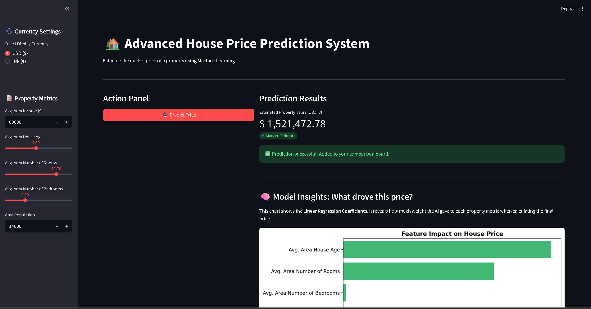

# 🏡 House Price Prediction System



**Course:** Data Science (21CSS303T) | **Project Type:** Mini-Project

An end-to-end Machine Learning web application that predicts regional house prices based on historical housing data. This project demonstrates the complete data science pipeline: from data loading and missing value imputation to model training and interactive deployment.

## ✨ Key Features

* **Interactive UI:** A clean, modern dashboard built with Streamlit.
* **Robust Data Pipeline:** Automatically handles missing data (NaN values) using Scikit-Learn's `SimpleImputer`.
* **Machine Learning:** Utilizes a Multiple Linear Regression model to find the mathematical relationship between housing metrics and market value.
* **Dynamic Currency Conversion:** Allows users to view predictions in either USD ($) or INR (₹) with a customizable exchange rate slider.
* **Explainable AI (XAI):** Includes a visual "Model Insights" chart that displays the exact mathematical weight (coefficients) the AI assigns to each property feature.
* **Comparison Board:** Users can save multiple predictions to a session-state dataframe for side-by-side analysis.

## 🛠️ Technology Stack

| Component | Technology | Purpose |
| :--- | :--- | :--- |
| **Language** | Python 3.x | Core programming language |
| **Data Manipulation** | Pandas, NumPy | Data cleaning, structuring, and array operations |
| **Machine Learning** | Scikit-Learn | Imputation, Train/Test splitting, Linear Regression |
| **Web Framework** | Streamlit | Building the interactive frontend application |
| **Visualization** | Matplotlib, Seaborn | Rendering the feature importance coefficient chart |
| **Model Serialization**| Joblib | Saving and loading trained model artifacts |

## 📁 Project Structure

```text
house-price-predictor/
│
├── data/
│   └── USA_Housing.csv         # Raw dataset (Add this before running!)
│
├── artifacts/                  # Auto-generated folder for saved models
│   ├── house_model.pkl
│   ├── imputer.pkl
│   └── features.pkl
│
├── train_model.py              # Backend script for training the model
├── app.py                      # Frontend Streamlit application
└── README.md                   # Project documentation
## 🚀 How to Run the Project
```

**Step 1: Install Dependencies**
Ensure you have Python installed. Open your terminal and install the required libraries:
```bash
pip install pandas numpy scikit-learn streamlit matplotlib seaborn joblib
```

**Step 2: Add the Dataset**
Create a folder named `data` in the root directory and place your housing dataset inside it (e.g., `USA_Housing.csv`).

**Step 3: Train the Model**
Run the training script to clean the data, train the Linear Regression model, and generate the necessary artifacts.
```bash
python train_model.py
```
*(You should see a success message and a new `artifacts/` folder appear).*

**Step 4: Launch the Web App**
Start the Streamlit server to interact with the application.
```bash
streamlit run app.py
```

## 🧠 Model Details & Mathematical Intuition

This system implements **Multiple Linear Regression** to predict a continuous target variable (`Price`). While simple linear regression uses one input, this project calculates the market value using multiple independent variables simultaneously.

### The Mathematics

The model calculates a "Best Fit" hyperplane to minimize the distance between actual data points and predicted values. The core equation used is:

`Price = (m₁ × Income) + (m₂ × Age) + (m₃ × Rooms) + (m₄ × Bedrooms) + (m₅ × Population) + b`

  * **The Weights (m₁...m₅):** These are the exact coefficients calculated by the AI during training. A positive coefficient means that as the feature's value increases, the house price increases.
  * **The Intercept (b):** The theoretical baseline price if all other features were zero.

### Why Multiple Linear Regression?

This algorithm was specifically chosen for this mini-project because:

1.  **Transparent & Explainable (XAI):** Unlike "Black Box" models (like complex Neural Networks), we can extract the exact coefficients to explain *why* a specific price was predicted.
2.  **Highly Efficient:** It trains rapidly on structured tabular data without requiring massive computational resources.
3.  **Statistical Validity:** It provides measurable accuracy metrics (like R² scores) to statistically prove the model's reliability.
